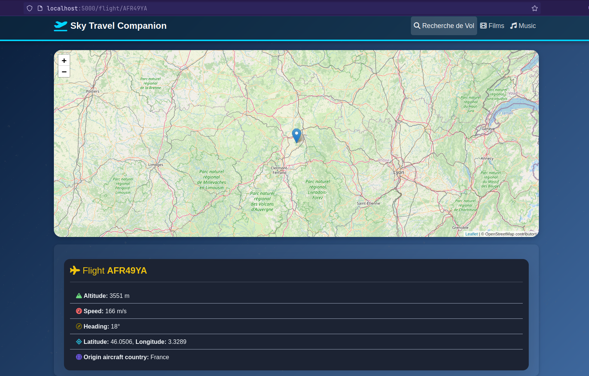
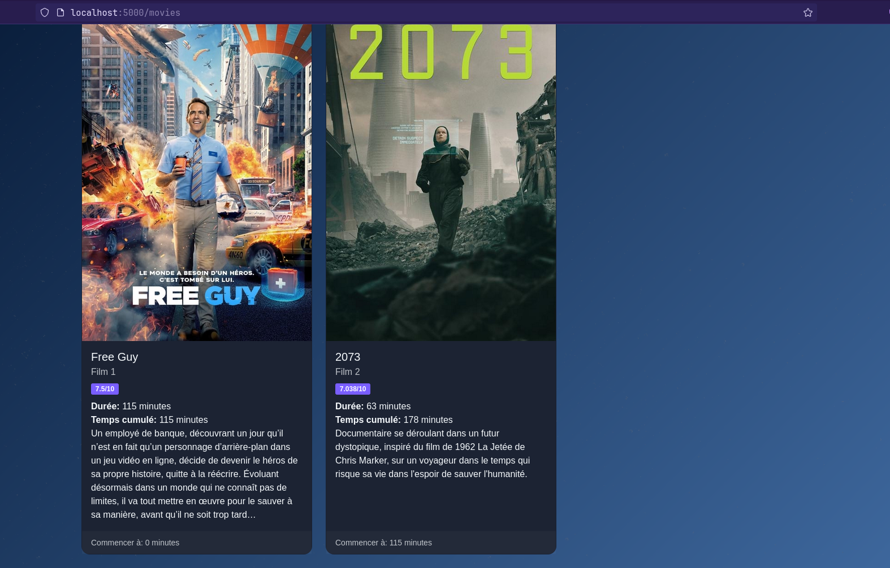
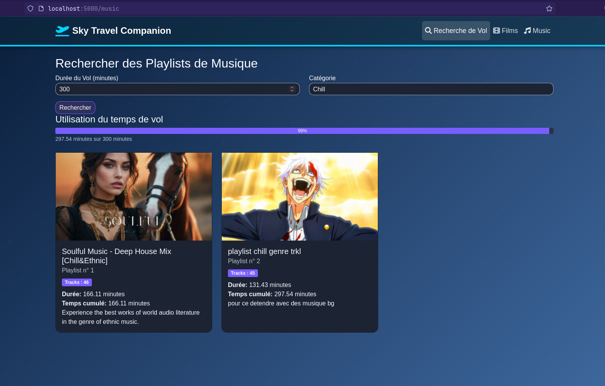
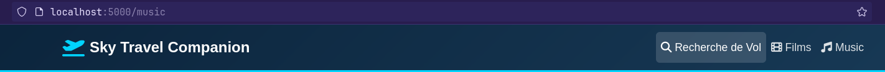

# Projet CICD : SkyTravelCompanion

## Présentation du projet
`SkyTravelCompanion` est une web app qui permet de récupérer les informations d'un vol avec son numéro de vol et de proposer des divertissements pour la durée du vol.
En renseignant un numéro de vol, les utilisateurs peuvent accéder aux informations en temps réel de leur avion et découvrir des suggestions de divertissements adaptés à la durée du trajet, comme des films et de la musique. 
L'application permet également aux voyageurs et à leurs proches de suivre le vol en direct.

## Features du projet
- Feature 1 :  
La première feature de l'application est d'afficher les informations d'un vol en direct. Notamment la position de l'avion sur une carte du monde en temps réel, la latitude/longitude de l'avion, ...  
`TIPS`: Pour trouver un avion facilement en cours de vol, vous pouvez utiliser le site suivant : https://www.flightradar24.com/


- Feature 2 :
La deuxième feature de l'application est de proposer des films en fonction du genre souhaité et renseigné par l'utilisateur en fonction de la durée totale du vol. 


- Feature 3 :
La troisième feature de l'application est de proposer des musiques (spotify) en fonction du genre souhaité et renseigné par l'utilisateur en fonction de la durée totale.



## Informations techniques sur le projet :
Pour la réalisation de notre application, nous avons utilisé différentes API externes : 
- OpenSky Network API : API pour récupérer des informations sur les vols **(pas de clé API nécessaire)**
- The Movie DataBase (TMDB) : API pour récupérer les films **(nécessite une clé API)**
- Web API Spotify : API pour récupérer les musiques de spotify **(nécessite une clé API)**

Pour la partie build, elle est crée au niveau de la CI dans GitHub Actions ce qui permet que cette partie soit automatisée. Lien DockerHbub de l'image Docker :
```
https://hub.docker.com/r/nobozor/skytravelcompanion
```
Certaines variables d'environnement sont nécessaires pour le bon fonctionnement de l'application :
- **`TMDB_API_KEY` : Clé API de l'API TMDB**
- **`SPOTIFY_CLIENT_ID` : Clé API de l'API Spotify**
- **`SPOTIFY_CLIENT_SECRET` : Clé API de l'API Spotify**
- (optionnel) LISTEN_PORT : Port d'écoute de l'application
- (optionnel) LISTEN_HOST : Host sur lequel l'application sera lancée
- (optionnel) FLASK_SESSION_SECRET_KEY : Clé secrète pour les sessions Flask

Pour la partie run, il est nécessaire de taper la commande suivante afin de lancer en local l'application : 

```bash
docker run --name SkyTravelCompanion 
-e TMDB_API_KEY="TOKEN_TMDB_API_KEY" 
-e SPOTIFY_CLIENT_ID="TOKEN_SPOTIFY_CLIENT_ID" 
-e SPOTIFY_CLIENT_SECRET="TOKEN_SPOTIFY_CLIENT_SECRET" 
-p 5000:5000
nobozor/skytravelcompanion:latest
```

Pour se connecter à l'application, il suffit de taper l'adresse suivante :

```
http://localhost:5000
```

# Utlisation de l'application

Une fois sur le page web de l'application, vous disposerez de 3 onglets situé en haut à droite de la page.



## Informations de Vol

Vous pouvez rentrer le numéro d'un vol en cours dans la barre de recherche et les informations correspondantes seront affichées (emplacement sur la carte en temps réel, altitude, vitesse, compagnie aérienne etc.)

## Films

Vous pouvez entrer la durée de votre prochain vol ainsi que le genre de film que vous souhaitez regarder et l'application vous retournera une liste de films qui rempliera la durée totale du vol (entre 80 et 100% de la durée).

## Musique

Vous pouvez entrer la durée de votre prochain vol ainsi que le style de musique que vous souhaitez écouter et l'application vous retournera une playsit qui rempliera la durée totale du vol (entre 75 et 100% de la durée).

# Collaborer au projet

Pour collaborer au projet, il suffit de cloner le projet et de créer une branche avec votre nom. Une fois les modifications faites, il suffit de faire une pull request et de demander une review à un autre membre du groupe. 

## tests

Les tests unitaires sont **obligatoires** pour toute nouvelle fonctionnalité. 
Les tests sont situés dans le dossier `unittests` et sont nommés `test_<nom_de_la_fonctionnalité>.py`.
Pour lancer les tests, il suffit de lancer la commande suivante dans le terminal :
```bash
pytest unittest/ --maxfail=1
```

## venv

Nous vous conseillons d'utiliser un environnement virtuel pour installer les dépendances du projet. Pour créer un environnement virtuel, il suffit de lancer la commande suivante dans le terminal :
```bash
python -m venv .venv
source .venv/bin/activate
pip3 install -r requirements.txt
```